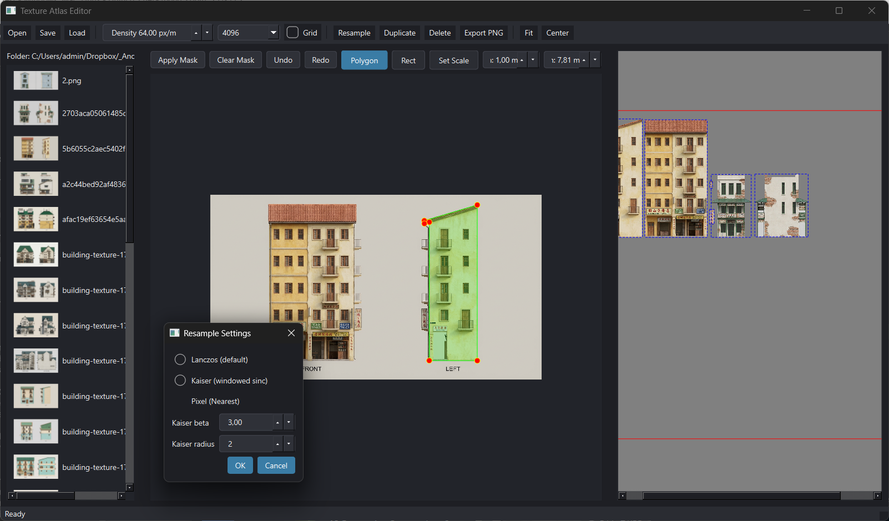
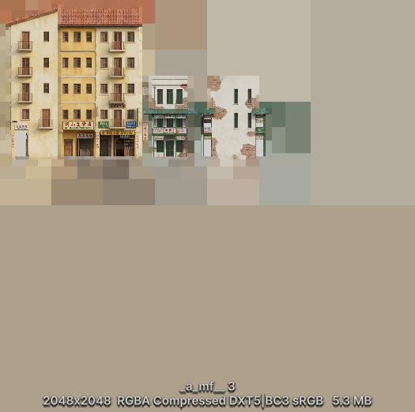
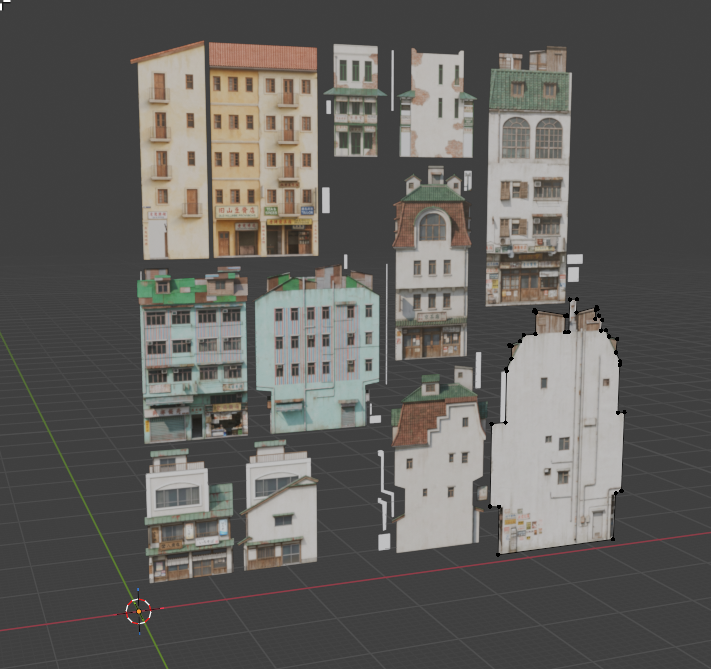

# Texture Atlas Editor

Небольшое приложение на PySide6 для нарезки масок из исходных текстур, их раскладки на атласе и экспорта в PNG. Тёмная тема, быстрый предпросмотр и удобные (лично дл меня)) инструменты редактирования.





## Возможности
- Импорт всех изображений из папки (png/jpg/jpeg/tga/bmp) в список с превью.
- Инструменты маски: Polygon и Rect, Shift для выравнивания рёбер, контекстное меню «Add Point Here»/удаление точки, Ctrl+drag перемещает всю маску.
- Set Scale: отмечаем эталонную линию (по умолчанию 1 м, можно другое значение) и получаем плотность пикселей на метр для правильного масштаба.
- Несколько масок на одну текстуру, дублирование и удаление элементов на канвасе, сохранение позиций элементов в проекте.
- Настройки атласа: размер 1–4K, плотность (px/m), сетка по плотности, кнопки Fit/Center, статус-бар с координатами и зумом.
- Ресемплинг: Lanczos (по умолчанию), Kaiser (beta/radius, экспериментально и медленно), Pixel/Nearest для пиксель-арта.
- Экспорт PNG с опцией mip flood (заливаем вне маски цветными каналами из следующих mip-уровней, альфа не трогаем); авто или 1–16 уровней.
- Undo/Redo для маски, Apply/Clear, краткие подсказки в UI.
- Алиасы путей: кнопка «Path Aliases» в тулбаре + подстановка переменных окружения (E:/Dropbox -> C:/Users/admin/Dropbox например, если работаете с разных компов) , чтобы проекты открывались на разных машинах с разными путями.
- Мультимаски: все маски одной текстуры видны одновременно, активная редактируется; новые маски создаются из списка, у каждой свой цвет.
- Направляющие: кнопки +H/+V добавляют горизонтальные/вертикальные линии, точки масок снапятся к ним; линии можно перетаскивать мышью.

## Рабочий процесс
1. Открыть папку с текстурами (загружается весь список).
2. Выбрать изображение в браузере, выбрать инструмент Polygon/Rect и отметить маску (Shift выравнивает, Ctrl+drag перемещает всю маску).
3. В режиме Set Scale протянуть эталонную линию нужной длины в метрах — плотность обновится автоматически.
4. Apply Mask добавляет вырезку на атлас; элементы можно дублировать и перемещать.
5. Настроить Atlas Density, размер холста, ресемплер (Lanczos/Kaiser/Pixel).
6. Включить Mip Flood при необходимости и экспортировать PNG. Проект можно сохранить в JSON и продолжить позже.

## Запуск
```bash
python -m venv .venv
.venv\Scripts\activate  # Windows
pip install -r requirements.txt
.venv\Scripts\python main.py
```

## Проектный файл
- JSON хранит textures (маски с points/real_width/original_width/px_per_meter), items (позиции на атласе), глобальные настройки (density/size, resample, mip_flood).
- Пути раскрываются через переменные окружения и алиасы из «Path Aliases» (хранятся в `~/.texture_processor_aliases.json`). Маски внутри одной текстуры перечислены в `masks[]`.

## Зависимости
- PySide6
- Pillow
- numpy

## OBJ export (новое)
- Тулбар → Export OBJ.
- Один объект (o mask_<id>) на маску, грань — n-gon по точкам маски.
- Вершины: метры (px / atlas_density), координатная система с +Y вверх для удобства в Blender, Z=0.
- UV: нормализованы к размеру атласа, origin внизу-слева (Blender-friendly).

## Backup saves (бэкапы проекта)
- Перед перезаписью проектного файла его текущая версия копируется в *_back_1.json рядом с основным файлом.
- Резервные копии сдвигаются по кругу до четырёх: _back_1 -> _back_2 -> _back_3 -> _back_4; самая старшая перезаписывается.
- Работает автоматически при каждом сохранении (Save) в приложении.

## Lock movement (блокировка перемещения)
- Правый клик по элементу на атласе открывает меню Lock/Unlock movement.
- Заблокированный элемент нельзя двигать, рамка становится чёрной; разблокированный — синяя. При выделении остаётся красная.
- Состояние блокировки пока не сохраняется в проект (чисто UI).


